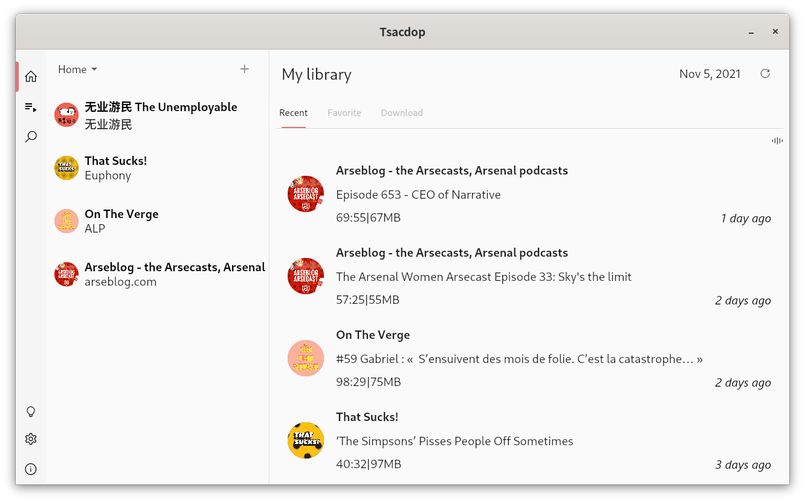

##  About

Enjoy podcasts with Tsacdop!
Tsacdop is a podcast player developed with Flutter, a clean, simply beautiful and friendly app, which is also free and open source.
This repo is windows version of Tsacdop, this is still on early stage.

Release soon.
## Preview



## Build

1. If you don't have Flutter SDK installed, please visit offcial [Flutter][Flutter Install] site.

   You need to upgrade to dev channel to build windows app. visit [https://flutter.dev/desktop](https://flutter.dev/desktop) for more info.

``` 
flutter channel beta
flutter upgrade
flutter config --enable-windows-desktop
```

1. Fetch latest sorce code from master branch.

``` 
git clone https://github.com/tsacdop/tsacdop_desktop.git
```

3. Add api search api configure file.  

Tsacdop desktop uses PodcsastIndex API pro to search for podcasts If you want to build the app, you need to create a new file named `.env.dart` in lib folder. Add the following code to `.env.dart` . You can get your own API key on [PodcastIndex](https://podcastindex.org/), it is free to all. 

``` dart
final environment = {
  "podcastIndexApiKey": "XXXXXXXX",
  "podcastIndexApiSecret": "XXXXXXXXXXXXXXXXXX"
};
```

4. Run the app with Android Studio or Visual Studio. Or the command line.

``` 
flutter pub get
flutter run
```

## Archetecture

### Plugins

* Local storage
  + sqflite
  + shared_preferences
* Audio
  + dart_vlc
* State management
  + riverpod
* Download
  + dio

## Contact

You can reach out to me directly at [tsacdop.app@gmail.com](mailto:<tsacdop.app@gmail.com>).

Or you can join our [Telegram Group](https://t.me/joinchat/Bk3LkRpTHy40QYC78PK7Qg)

## Credit

[Alexmercerind](https://github.com/alexmercerind/) 

Thanks for the plugin and I also learned a lot from Harmonoid.


[Homepage Screenshot]: https://raw.githubusercontent.com/stonega/tsacdop_desktop/master/preview/linux_home.png
[Dark Mode]: https://raw.githubusercontent.com/stonega/tsacdop_desktop/master/preview/homepage.png
[github release]: https://img.shields.io/github/v/release/stonega/tsacdop_desktop
[github release - recent]: https://github.com/stonega/tsacdop_desktop/releases
[github downloads]: https://img.shields.io/github/downloads/stonega/tsacdop_desktop/total?color=%230000d&label=downloads
[localizely]: https://img.shields.io/badge/dynamic/json?color=%2326c6da&label=localizely&query=%24.languages.length&url=https%3A%2F%2Fapi.localizely.com%2Fv1%2Fprojects%2Fbde4e9bd-4cb2-449b-9de2-18f231ddb47d%2Fstatus
[style: effective dart]: https://img.shields.io/badge/style-effective_dart-40c4ff.svg
[effective dart pub]: https://pub.dev/packages/effective_dart
[license]: https://github.com/stonega/tsacdop/blob/master/LICENSE
[License badge]: https://img.shields.io/badge/license-GPLv3-yellow.svg
